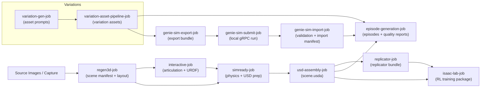

# Pipeline Overview (Mermaid)

This overview diagram aligns with the job naming and flow described in:
- `docs/PIPELINE_ANALYSIS.md`
- `docs/GENIESIM_INTEGRATION.md`
- `docs/PRODUCTION_E2E_VALIDATION.md`

Notes:
- Episode generation consumes the USD scene output plus variation assets, consistent with the E2E validation gates in `docs/PRODUCTION_E2E_VALIDATION.md`.
- Genie Sim jobs follow the local health-check and gRPC integration flow in `docs/GENIESIM_INTEGRATION.md`.
- The upstream asset preparation flow mirrors the component breakdown in `docs/PIPELINE_ANALYSIS.md`.

## Experimental / Optional Add-ons (Disabled by Default)

When explicitly enabled, the pipeline can branch to experimental add-ons:
- **DWM preparation** (`dwm-preparation-job`) for egocentric interaction bundles.
- **Dream2Flow preparation** (`dream2flow-preparation-job`) for video/flow bundles.

These steps are intentionally omitted from the core diagram because they are
disabled unless explicitly enabled.
