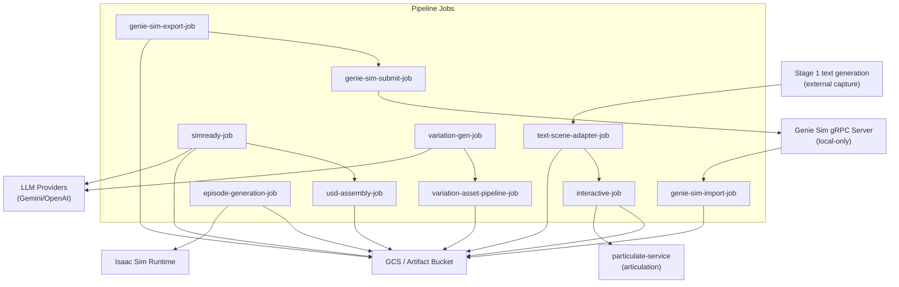

# Service Interaction Diagram (Mermaid)

This diagram highlights the runtime services and external dependencies referenced in:
- `docs/PIPELINE_ANALYSIS.md`
- `docs/GENIESIM_INTEGRATION.md`
- `docs/PRODUCTION_E2E_VALIDATION.md`

Notes:
- `interactive-job` depends on `particulate-service` for articulation detection.
- `genie-sim-submit-job` talks to the local Genie Sim gRPC server; the ports and health checks are tracked in `docs/GENIESIM_INTEGRATION.md`.
- GCS (or the configured artifact bucket) is the shared persistence layer across stages, which underpins the marker-driven workflow checks described in `docs/PRODUCTION_E2E_VALIDATION.md`.
